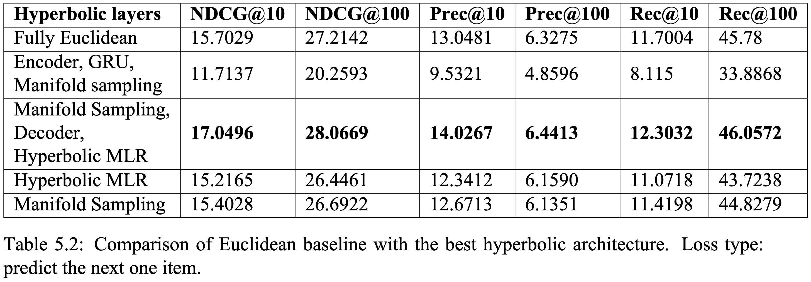
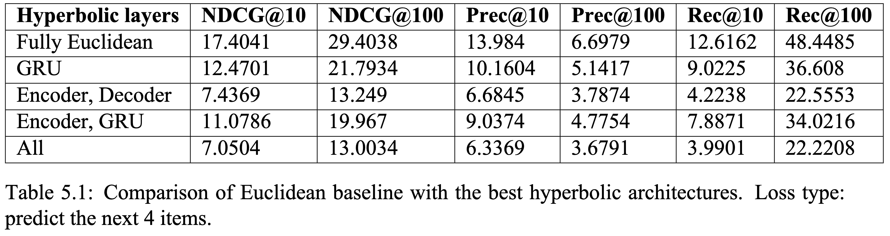

# Hyperbolic Sequential Recommender System for Top-N Recommendations
Accompanying code for the Data Science MSc thesis at Skoltech.
This code contains notebooks with described experiments and implementation of Sequential VAE matching with [HyperbolicRecommender](https://github.com/evfro/HyperbolicRecommenders) pipeline for convinient experiment runs.

## Results
<p align="middle">
  
   
</p>


## Data
To reproduce the code, please download [Movielens-1M dataset](https://grouplens.org/datasets/movielens/1m/) and preprocess it using ```src/ml_seq_preproc/py``` 


Also, please install the nessesary requirements by running ```pip install -r requirements.txt``` 


## Acknowledgments
The code is based on the following repositories:
* [HyperbolicRecommender](https://github.com/evfro/HyperbolicRecommenders)
* [Sequential VAE for Collaborative Filtering](https://github.com/noveens/svae_cf) 

The implementation of hyperbolic layers is taken from:
* [geoopt](https://github.com/geoopt)
* [hyptorch](https://github.com/leymir/hyperbolic-image-embeddings)
